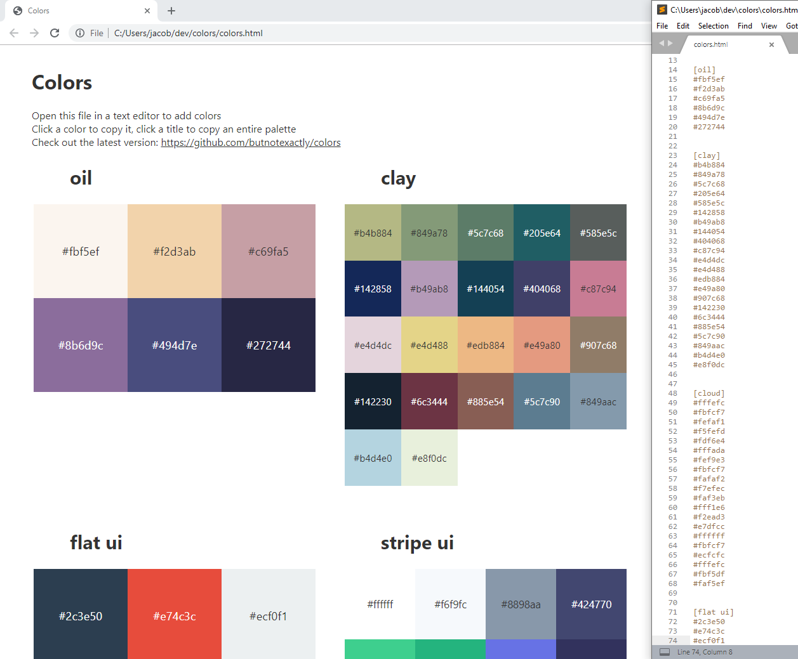

# colors

A simple way to organize, preview and copy your favorite color palettes all in a single file.  
Codepen Demo: https://codepen.io/butnotexactly/pen/XWWRYdR



## Why?

* Easy to edit; just open the html file in a text editor and add a few colors in the provided space, save and reload:
```
[flat ui]
#2c3e50
#e74c3c
#ecf0f1
#3498db
#2980b9
```

* Lightweight, offline and portable — it's a single file, and easily be placed in Dropbox or Git or on any device
* Perfect for quickly referencing colors (click a color->copy color, click a title->copy all the colors with line breaks)
* Doesn't require another app or service (you can just open it in browser to read from or a text editor to edit)

## Can it read or write files automatically or sync to a server?

No, it's a single, offline static HTML file without any read or write access.